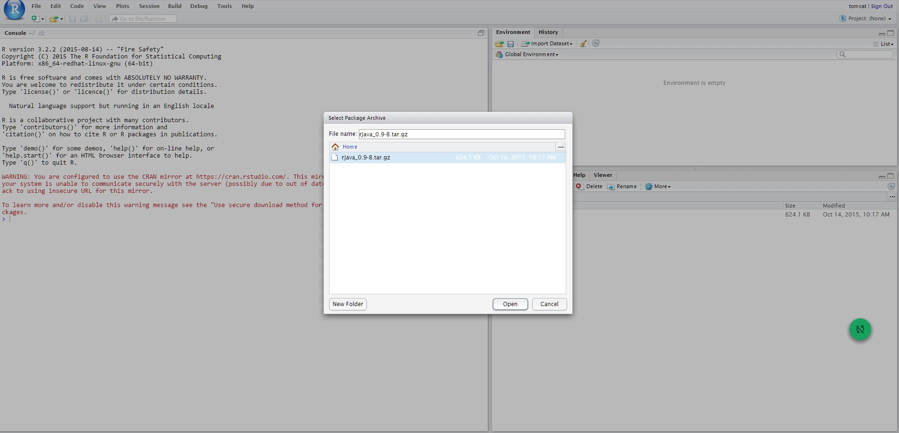

R installation
===================

It is required the installation of the following components for the correct operation of the data mining engine:

-  R
-  R Studio
-  rJava

**[LINUX]** The first two components, needed for the functionality of the Knowage data mining engine, has to be installed through the ``rpm`` comand, and, the third, through the RStudio GUI. Once retrieved the RPM file, open the folder and launch the comands:

.. code-block:: bash
   :caption: Commands for the rpm file
   :linenos:
  
   rpm -Uvh ./R-3.2.2-1.el6.x86_64.rpm               
   yum install --nogpgcheck rstudio-server-rhel-0.99.486-x86_64.rpm
   cp ./RStudio/rJava_0.9-8.tar.gz $TOMCAT_HOME
   chown tomcat $TOMCAT_HOME/rJava_0.98.tar.gz
   chown -R tomcat.root /usr/lib64/R/library && chmod -R 775 /usr/lib64/R/library 
   chown -R tomcat.root /usr/share/doc/R-3.2.2 && chmod -R 775 /usr/share/doc/R

Typing the address ``http://server_ipormachine_name:8787/`` in the browser, the user gets on screen the page showed below:

.. figure:: media/image24.png

   Sign in RStudio.

Then log in with the user credentials used for the Tomcat 7 installation: tomcat / <tomcat_user_password>.

The following images show the sequence of steps the user will encounter:

.. figure:: media/image25.png

.. figure:: media/image27.png

Meanwhile the package is installed, remember to answer NO when asked to create a personal library in the user home (that can be found under ``$HOME/RStudio/log``). This way, rJava will be installed in the directory ``/usr/lib64/R/library/rJava``.

Finally, edit the ``TOMCAT_HOME/bin/setenv.sh`` adding the following commands:

.. code-block:: bash
   :linenos:

   export R_HOME=/usr/lib64/R                          
   export LD_LIBRARY_PATH=/usr/lib64/R/library/rJava/jri
