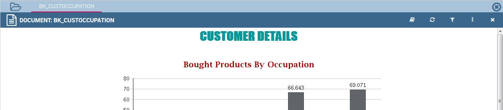
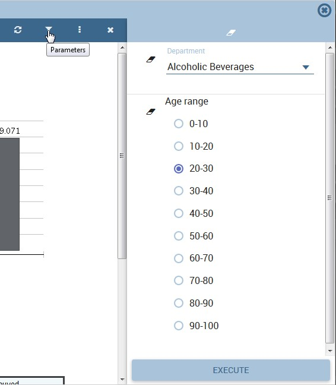
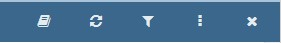
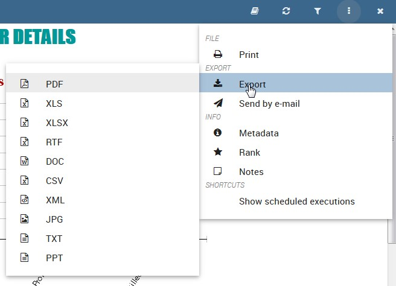
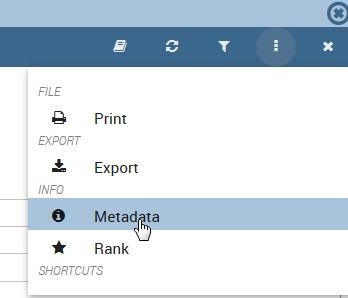
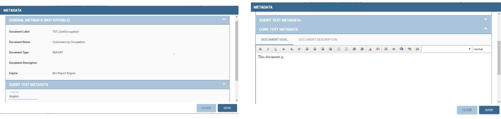
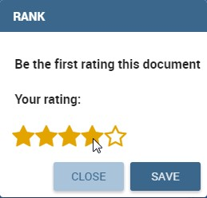
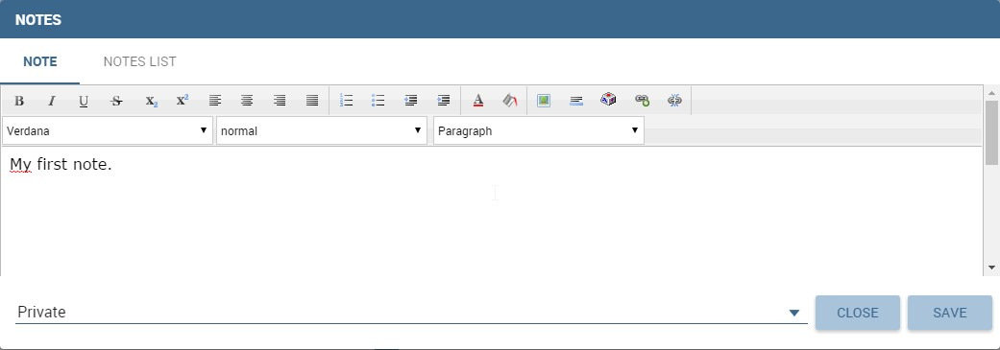

Document Execution
==================

In this chapter we describe all the features related to Knowage analytical documents, such as parameters management, printing, exporting and so on.

First of all, notice that once you execute a document from the document browser or from the menu, it is visualized full screen. In the first case, you can return to the document browser by clicking on the folder icon located at the top left.

 
    Back to Document Browser

Parameters management
-------------------------

Knowage documents may have associated parameters. If any, you will be asked to select the chosen parameter’s values in a collapsible panel located at the top or on the right side of the page. If this is the case, choose the parameters values and then click the **Execute** button to run the document. In case there are only optional parameters or default values are already defined, the document is directly executed after the first click on its relative icon. 

   Parameters panel

Mandatory parameters are shown in bold together with an asterisk on the right, while optional parameters are normal shaped.

It is possible to show or hide the parameter panel by clicking on the filter button located in the document toolbar. With the **Reset** button at the top of the panel you can clear the form.

Furthermore, the parameter configuration can be saved for future use. This is particularly useful when the document includes several customized parameters. This feature is accessible from the toolbar located at the top right corner of the parameters panel.

- **Reset** inserted values for parameters;
- **Open saved** a window listing the **saved parameters**, so that you can select or modify them;
- **Save** the parameters. Here you can choose between two options: **Public** means visible to all the other users that share your role while **Private** means visible only to you.

Document Toolbar
--------------------

All documents inside Knowage environment share the same toolbar with different features. We provide first a short description and next a detailed explanation.

.. _documenttoolbar:

   Document Toolbar

The |image34| button is to access the help online as defined in the Glossary and it is available only in KnowageSI.

.. |image34| image:: media/image28.png
   :width: 30

The |image35| refreshes the document.
   
.. |image35| image:: media/image29.png
   :width: 30

The |image36| opens the parameters panel and it is visible only if there are parameters associated to the document.

.. |image36| image:: media/image30.png
   :width: 30
   
The |image37| opens the contextual menu shown in figure below. We describe the main functionalities provided by this menu in the following.

.. |image37| image:: media/image31.png
   :width: 30

.. _toolbarcontexmenu:

   Toolbar contextual menu

Exporters
~~~~~~~~~~~~

Each Knowage document can be exported into several formats, depending on the options offered by the engine.

Clicking **Export** in the document toolbar you will see the available formats for the current document. Select one and check the exported document.

Business and structural metadata
~~~~~~~~~~~~~~~~~~~~~~~~~~~~~~~~~~~~

Knowage allows the definition of business metadata to describe an object, in our case a document. Business metadata, unlike technical metadata used in Knowage Meta to build the metamodel, are business information associated to the document intended to help users to understand, access and classify it. As such, they have been mainly conceived for the end user understanding.

There are three types of business metadata, some of them are editable while others can only be read. In particular, general metadata are read-only, while short and long text metadata are editable. General metadata contain basic information about the document, which cannot Notes be altered because they are related to the structure of the document (e.g., type, engine, label). They provide useful and synthetic information on the document. Short and long text metadata should be used to add relevant business information: all the allowed users will see this information, which will help them understand the purpose and context of that document.

In general, metadata should be edited by users with adequate expertise and authority to do so. Therefore, it is possible for the administrator to assign the right to edit and save metadata only to some users. The right is not specific to a profile, but it is part of the authorizations that can be granted to any role. This applies to bookmarks as well.

Metadata can be accessed from the toolbar clickin the corresponding item in the contextual menu as shown in the following figure.

   View document metadata

As stated before, in order to see and/or edit metadata the user roles need some grants. Knowage administrator manages this authorizations. If you have editing metadata authorization, you will be able to see to change them. If you want to edit short metadata just click in the value area and write what you prefer. If you want to edit long metadata just click in the value area and an HTML editor will appear.

When you are satisfied with what you wrote just click on the **SAVE** button. We provide the following example.

   Left: General and short metadata, Right: editing long metadata

Notes
~~~~~~~~~~~~

Knowage offers a simple collaborative tool to share notes and comments on documents, allowing users to share information and receive feedback. This may be useful, for example, to limit the number of exchanged e-mails: notes can be stored online and are accessible to all users sharing the same access rights. Each user can add a single note to a single document.

Click on **Notes** in the contextual menu of the document toolbar. In this way a text editor opens where you can type your comment. Make it private or public (i.e., accessible to users with the same rights as you) by selecting the preference in the appropriate box. Click **Save** to confirm. All public comments from all users, as well as your private notes, will be shown the next time you open this window. If you want to edit or delete a note, click on the Rate document corresponding symbols in the **Note list** tab. You can also export the note in PDF or RTF format.

Rate document
~~~~~~~~~~~~~~~~~~~~~~~~

The aim of this functionality is to acquire explicit quality data that can be further used. Specifically, it allows the administrator to identify anomalies about the use of an analytical document by end users. Rating a document means assigning it a value from the end user perspective. This brings additional information with respect to traditional audit and monitoring data, which can track the number of executions but cannot interpret users motivations and feelings.

   Rating a document

To rate documents, click on **Rank** in the contextual menu of the document toolbar. Choose the document ranking in the pop-up window and click **Save**. The administrator can exploit the result of votes, in order to evaluate and improve the quality of the document.

   Share notes and comments

Scheduled Execution
~~~~~~~~~~~~~~~~~~~~~~~~

The administrator has the possibility to set schedulation for documents. These schedulations can be accessed by **Show Scheduled executions**.
 

