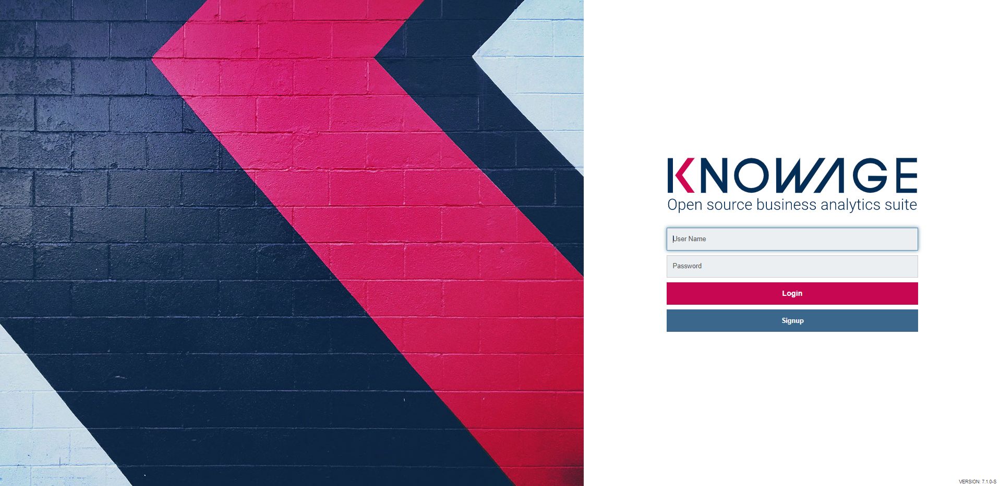
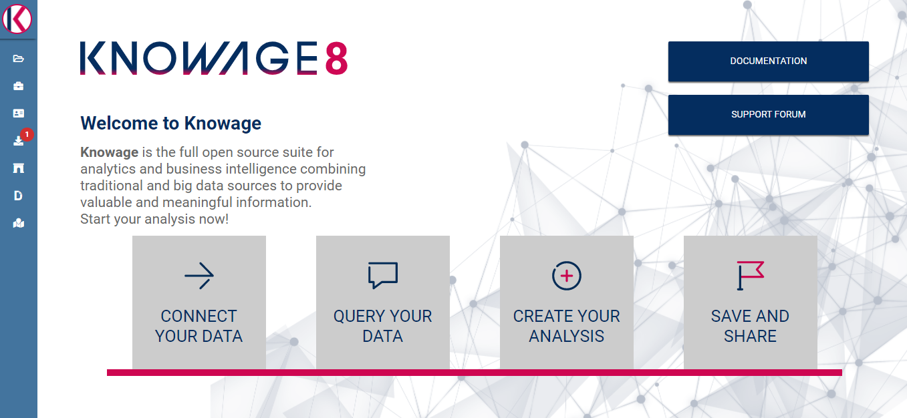
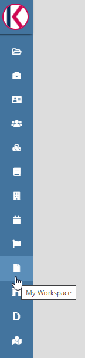

User Interface
=============

This chapter focuses on Knowage user interface, providing detailed information on the Main Menu, the Document Browser and some general settings concerning analytical documents. First of all, a short introduction on profiling rules its provided.

Preliminary information
---------------------------

The administrator will provide you a username and a password to log in Knowage environment.

   
   Login page

These credential identifies you as user and are associated to your *role*.

In Knowage suite, roles represent categorizations of group of users, granting each user with different rights and visiblity criteria on documents and data, according to their business profile.

This is what is called *Behavioural Model*. It allows to:

-  reduce the required number of analytical documents,
-  code only once the behavioural and visibility rules on data,
-  guarantee the uniform growth of the project over time,
-  guarantee the respect of the visibility rules over time, with no limit on the number analytical documents that can be added.

All the analytical documents are strictly related to the behavioural model. In fact, the behavioural model guides the behaviour of the analytical documents according to the user’s role, managing the visibility of documents and data.

Every role belongs to a predefined *role type*. The available role types are listed and described below.

.. table:: Role types
   :widths: auto

   +-----------------------------------+-----------------------------------+
   |    Role Type                      | Description                       |
   +===================================+===================================+
   |    General administrator.         | Manages all Knowage               |
   |                                   | functionalities.                  |
   +-----------------------------------+-----------------------------------+
   |    Model administrator.           | Manages the behavioural model and |
   |                                   | its associated functionalities.   |
   +-----------------------------------+-----------------------------------+
   |    Developer.                     | Creates and modifies datasets and |
   |                                   | documents.                        |
   +-----------------------------------+-----------------------------------+
   |    Test user.                     | Tests analytical documents.       |
   +-----------------------------------+-----------------------------------+
   |    End user.                      | Executes documents visible to him |
   |                                   | and creates ad-hoc reporting      |
   |                                   | analysis.                         |
   +-----------------------------------+-----------------------------------+

From now on we suppose the reader has a role of type “End user”. If some grants are optional for this role we will state it.

Main menu
-------------

.. _homepage:

   
    Home page

The menu gives you access to documents, data and all the functionalities that you are allowed to use. By default the menu button is at the left bottom corner of the home page: clik it to open the menu.

Main menu consists in a set of icons associated with basic features. It is divided in two submenus: the general menu, which is collapsed, and the BI functionalities menu. It is important to underline that not all the components of the menu are mandatory, but they may be configured by the administrator according to user’s needs.

.. table:: Menu components - General menu
   :widths: auto
   
   +-------------------------------+-----------------------+-----------------------+
   |    Icon                       | Name                  | Description           |
   +===============================+=======================+=======================+
   | .. figure:: media/image8.png  | Knowage user          | Open a hidden menu    |
   |                               |                       | with extra            |
   |                               |                       | functionalities.      |
   +-------------------------------+-----------------------+-----------------------+
   | .. figure:: media/image9.png  | Select role           | Select the            |
   |                               |                       | authentication role   |
   |                               |                       | (available if you are |
   |                               |                       | associated to more    |
   |                               |                       | than one role).       |
   +-------------------------------+-----------------------+-----------------------+
   | .. figure:: media/image10.png | Languages             | Language options.     |
   +-------------------------------+-----------------------+-----------------------+
   | .. figure:: media/image11.png | Info                  | Infos about Knowage   |
   |                               |                       | version.              |
   +-------------------------------+-----------------------+-----------------------+
   | .. figure:: media/image12.png | Log Out               | Log out.              |
   +-------------------------------+-----------------------+-----------------------+
   
.. table:: Menu components - BI functionalities menu
   :widths: auto
   
   +-------------------------------+-----------------------+-----------------------+
   |    Icon                       | Name                  | Description           |
   +===============================+=======================+=======================+
   | .. figure:: media/image13.png | Document browser      | Show the archive      |
   |                               |                       | folders and related   |
   |                               |                       | documents.            |
   +-------------------------------+-----------------------+-----------------------+
   | .. figure:: media/image14.png | Workspace             | Inquiry, navigate and |
   |                               |                       | create your data.     |
   |                               |                       |                       |
   |                               |                       | Available only for    |
   |                               |                       | KnowageBD and         |
   |                               |                       | KnowageSI.            |
   +-------------------------------+-----------------------+-----------------------+
   | .. figure:: media/image15.png | Functions catalog     | Access data mining    |
   |                               |                       | functions.            |
   +-------------------------------+-----------------------+-----------------------+
   | .. figure:: media/image16.png | Glossary definition   | Access the glossary   |
   |                               |                       | area.                 |
   |                               |                       |                       |
   |                               |                       | Visualise the         |
   |                               |                       | existing words and    |
   |                               |                       | glossaries.           |
   |                               |                       |                       |
   |                               |                       | Create new words and  |
   |                               |                       | glossaries.           |
   +-------------------------------+-----------------------+-----------------------+
   | .. figure:: media/image17.png | Calendar              | Access the calendar   |
   |                               |                       | list. Create a new    |
   |                               |                       | calendar.             |
   +-------------------------------+-----------------------+-----------------------+

Document Browser 
   This is a standard functionality of Knowage Server. It enables you to access.

Workspace 
   This is available only for KnowageBD and KnowageSI. Entering the Workspace you will find the sections: **Recent**, **Documents**, **Data** and **Analysis**. The “Recent” area shows the latest documents you were working on, while “Documents” contains the analytical documents the user asks to be archived on this area. This way the user has a more rapid and efficient way to retrieve the documents of his interest. The “Data” section is made up of the “Dataset” and the “Models” subsections. In the **Dataset** one you can access all the self-service BI features. Once entered this section, your datasets appear divided into four categories:
   
      .. _userdatasetsuser:
.. figure:: media/image18.png

            User Datasets

   -  **MY DATA SET**, containing all the datasets created by you,
   -  **ENTERPRISE DATA SET**, where you can find the datasets created by the developer and released to the users,
   -  **SHARED DATA SET**, containing datasets created by other users and shared with you,
   -  **CKAN DATA SET**, available only for KnowageBD, where you can search for open data among different portals and save the selected        ones in your environment.

   From here you can also modify your existing datasets or create new ones for instance uploading a CSV or XLS file.

   In the **Models** one instead you have two tabs on the right side of the interface. The **Business** tab allows you to access models    built up for you by the developer and inquiry them using the QbE interface. In the **Federation definition** tab you can create          federation between one or more existing dataset using the specific GUI or just access the exiting ones as well.

   Analytical documents, navigate the document folders tree, search, sort and execute documents.

   Finally selecting **My Analysis** section, available only for KnowageBD and KnowageSI, you enter a new page where you can navigate and create your self-service analysis.

Functions catalog
   Lets the user enter the data mining functions a technical user has previuously developed.

Glossary definition
   The user can define the proper glossaries and related words useful for his own analysis.

Calendar 
   Allows the user to specify the festivity days of a certain time frame.

The **General menu** is identified with the first icon in General Menu and a label containing your user name. Opening the general menu you have the following extra buttons:

Select role 
   If your user is associated with more than one role, Knowage requests you to specify the default role. You can select it when executing a document, or right after authentication by clicking on this icon and choosing a default role.

Languages
   Select the language of Knowage environment.

Info
   View the details of current Knowage version.

To conclude the overview of this area we describe a not mandatory element. When configured by the Knowage administrator, you can have quick links to a static page, a document, a folder or an external application, like for instance a web page. These links are displayed below the BI functionalities menu, as shown below.

   Quick links

You can minimize the main menu by clicking the right arrow at its bottom right corner. This way the main menu is replaced by the menu button, so that you can close/open it according to your needs. You can move this button around the page by dragging and dropping it. Choose the position that best fits with your work.

Document Browser overview
-----------------------------

From BI functionalities Menu, select |image20| to open the Document Browser.

.. |image20| image:: media/image20.png
   :width: 20

.. figure:: media/image21.png
   
   Document Browser

By default the page is divided in two parts, as shown in Figure above: in the left side there is the functionality tree representing the folder structure, while on the right you can see the list of all documents contained in the selected folder. You can switch to the document preview view by clicking on grid icon in the top right corner, as shown in figure below.

.. figure:: media/image22.png
   
    Changing documents view

Each line shows the label, the name, the author and the type of the document, while the play button at the end of each row executes the document. Moreover, clicking on a line opens a side panel on the right of the page. Here you can see more metadata information such as the document description, the state and the creation date (see Figure below).

.. figure:: media/image23.png

   Documents details expanded.

.. |image24| image:: media/image24.png
   :width: 30

At the top of this side panel you find the |image24| button, the same one you see at the end of each document line. Click on it to execute the document.
